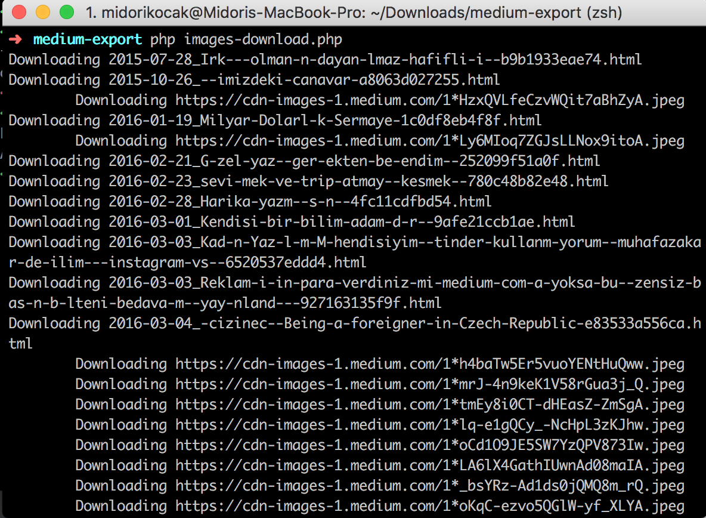

# medium-images-downloader

Easy to use tool to download images from medium export



## How it works

Recently  I wanted to leave medium.com and go back to wordpress. I exported my data, and found out that images were just not included. 
Also, medium included only links to small images.
I was very frustrated and I wrote this tool. Let me tell you how it works:

* First it searches for the medium export files in the directory you are in. Medium files have names like YYYY-MM-DD-whatever-(Hash with 12 hex digits).html
* After it searches your files for images. Exported Image links by medium are small (400/800 etc). So this tool replaces the url and gets the original file.
* Downloads all images to ```export/img``` folder.
* Then it replaces all image links in your html files, and saves them to ```export``` folder.
* Original html exports stays the same. 

It downloads all files, so it can take some time.

## Install

* First make a backup copy of your medium-export directory.
* Copy files of this repository to your medium-export backup directory and use command

	``` bash
	$ composer install
	```
	
## Usage

* Go to your medium-export backup directory and run this command

	``` bash
	$ php images-downloader.php
	```
	
* Go to ```exports``` folder.

## Contributing

Please see [CONTRIBUTING](CONTRIBUTING.md) and [CONDUCT](CONDUCT.md) for details.

## Credits

- [Midori Kocak][link-author]

## License

The MIT License (MIT). Please see [License File](LICENSE.md) for more information.

## Attention

No WARRANTY. I have no responsibility if you lose your files. Please use with caution. Backup your files as instructed.
[link-author]: https://github.com/midorikocak
